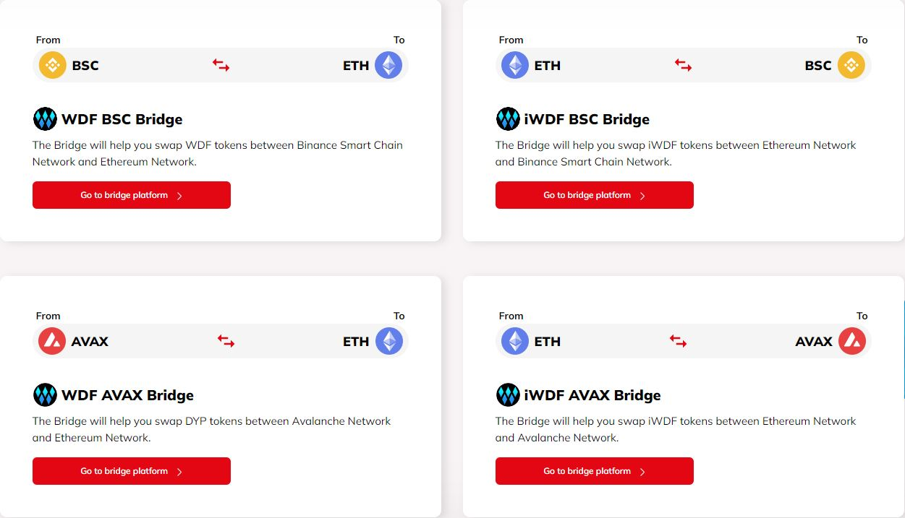

# 🌁 Bridge

### `Bridge Introduction`

A bridge or interchain bridge is a service (centralized or decentralized) that allows you to create a connection between two blockchains that cannot normally communicate with each other, so that tokens can be transferred between them.\
This is a utility that has become essential thanks to the arrival of DeFi services, which have taken the crypto community a big leap in the use of blockchain technology and the tokens that make life on the different blockchains capable of providing this type of service.

### `Bridge Application`

A bridge can be thought of as a simple information exchanger between blockchains. In other words, the main function of a bridge is to allow the bidirectional exchange of information between blockchain A and blockchain B, via a protocol that enables this connection.

### `DeFi Wallet Bridge`

At Wallet DeFi we will have our own transaction bridge, where the protocol will operate on the main tokens, so we can make transactions from the BSC network to the ETH network, we can do the opposite, among other options, always allowing bidirectional information between the selected blockchains. Below is an image of the bridge on our platform:

<figure><figcaption></figcaption></figure>

