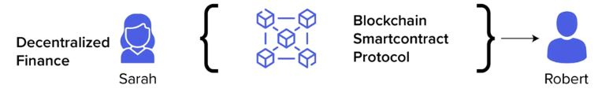

# 💥 DeFi Concepts

### `DeFi Introduction`

There is no doubt that technology is leading to fundamental changes in all areas of society, fostering innovation in various sectors, especially finance, where the economic impact is manifested through new approaches.\
``\
``In recent years, with the advent of blockchain technology, the technology behind cryptocurrencies, it has been possible to recreate products and services related to traditional finance.\
The term DeFi, Decentralized Finance, refers to this set of applications, which aims to remove intermediaries from transactions, such as banks, brokers, and other institutions.\
\
Even today, traditional financial systems tend to be more inaccessible, as well as being centralized. DeFi does not discriminate and allows anyone with an internet connection to use financial services, in an affordable and efficient way, taking advantage of the transparency and freedom of the crypto-active universe.

### `DeFi Application`

In practice, DeFi protocols are built on smart contracts, which are self-executing programs using blockchain technology to ensure that the signed agreement is fulfilled and that transactions do not need intermediaries. Most of them are built within the Ethereum network, but many other alternatives are emerging, offering more speed and scalability, and at lower costs.

To remind you, blockchain refers to a decentralized database that allows users' digital information to be transferred, recorded, and tracked using encryption. It is similar to a traditional database, but the information is recorded in blocks that are linked together via "chains" in order to make sure that it is fraud-proof.

In order to decentralize finances effectively, the protocols are supported by foundations and institutes that enable self-governance. In this way, the users that hold the governance tokens of such a project are entitled to voting power and can help in the major decisions.

### `Wallet DeFi`

At Wallet DeFi, we will have numerous protocols, where we will simulate traditional financial market data, such as loans, asset trading, payments, resource management, NFT purchases in our marketplace, among several other functions.

<figure><figcaption></figcaption></figure>
