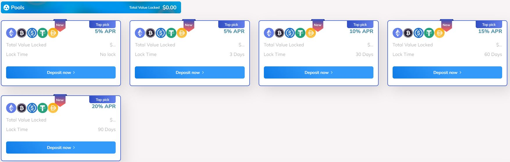

# ⛰ Farming

### `Farming Introduction`

Also known as liquidity mining, farming is a process that allows those who own cryptocurrencies to earn rewards for their investments. There are several platforms for doing this type of trading.In relation to decentralized applications and platforms, the main purpose of the tool is to attract liquidity and reward investors willing to lend their digital assets.\
Usually, the borrowing party performs leverage financial operations. The goal is to take advantage of high volatility to make profits generated by price variations of cryptocurrencies on the market.

### `Farming Application`

If you want to understand the process, know that it involves locking digital assets into smart contracts to generate pools of liquidity in exchange for interest and other rewards. To do this, an investor must deposit units of a cryptocurrency to receive trading fees.The returns on crypto assets borrowed in DeFi protocols are presented as an annual percentage yield. Therefore, the operation of the mechanism is similar to what occurs in the traditional lending system.

Moreover, as more investors add funds to the related liquidity pool, the value of the return earned increases. Some platforms also reward users with additional returns from the protocol's native token, known as a governance token.These tokens give cryptocurrency owners the ability to have a say in the directions of their development. Thus, they can participate in votes and influence decisions regarding protocols, products, or development roadmaps.

### `Wallet Defi Farming`

At Wallet Defi, we will develop blockchains through HTTP protocols, which will generate pools of liquidity in exchange for interest and other rewards for our investors, so that all holders will have access to our pools with exceptional rewards through our return rates.

|  No lock |    30D    |    60D    |    90D    |
| :------: | :-------: | :-------: | :-------: |
| **`5%`** | **`10%`** | **`15%`** | **`20%`** |

<figure><figcaption></figcaption></figure>

<figure><figcaption></figcaption></figure>
