# 👻 Overview NFT's

### `Overview NFT's Wallet DeFi`

Wallet DeFi. offers you an easy way to keep all your unique ERC721 and ERC1155 crypto NFTs and game assets in one place. Love your crypto NFTs? We love them too. Store them all in your Wallet DeFi.

### `What are NFTs?`

NFTs are non-fungible digital assets mostly referred to as ERC721, ERC1155 on Ethereum, BEP721 and BEP1155 as NFTs on BSC that are either unique or limited in quantity. Think of them like you would a famous painting by Picasso or the video game Gamma Attack for the Atari 2600. NFTs are like vintage baseball cards but only in a digital form that is unique, non-fungible and secured using cryptography. Usually, crypto collectibles are represented as real-life objects such as pets or avatars. Some crypto collectibles are computer generated works of art. Each token has variations in specific attributes and there are limits to the number of tokens that can be generated.

### `Where do I store NFTs?`

Trust Wallet provides an easy way to store and access all your crypto collectibles on Ethereum and BSC with peace of mind and security. Crypto collectibles are secured on the blockchain and associated with a public address. Over the last few years, we have seen various versions of crypto collectibles such as CryptoPunks, CryptoKitties, Decentraland, Axies and more which have become very popular.

### `Wallet DeFi - Come in and Join the society !`

Since the beginning of time, cats have been worshiped like gods and they will never let you forget it! In a never-ending quest to preserve their god-like status, cats have taken up a fancy new hobby: they love luxurious styles Well, just like cats, styles are always right and require a lot of attention and care to keep them in pristine condition.

Fabulous Cats (CATS) are randomly generated cat NFTs from over 125 different traits. The Society's population has almost reached capacity and is ready for adoption!

These unique icons will live on the Polygon blockchain as MATIC tokens and they’ll be hosted on Opensea.

Through the adoption process, your cat will receive a cool luxury feature and will also grant you access to the association's members-only benefit zone. As a new cat owner, you will receive 10% of minting fees and be able to join the CATS betting pool to earn ETH rewards.

### `Cats Society`

* Initial sale will start soon.
* To get your **CATS NFT**,
* check out the collection on OpenSea.

<figure>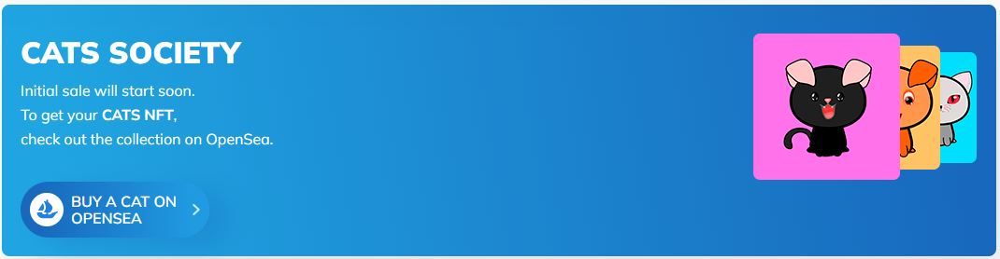<figcaption></figcaption></figure>

### `Cats 2D Game`

* Play as a CAT NFT inspired character.&#x20;
* Exclusive to CAT NFT holders.

<figure>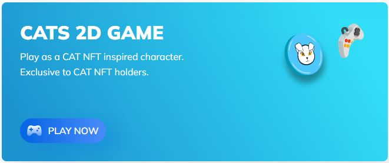<figcaption></figcaption></figure>

### `NFT Staking`&#x20;

Time for staking has finally arrived! You can now do even more with your NFT. Staking is as easy as you’d expect: To get started, simply select one or all of your minted NFTs, and begin earning continuous ETH rewards!

<figure><figcaption></figcaption></figure>

### `All the Traits`

Discover all the little details that make each cat as smug, cute and adoptable as the other. You can easily discover their story and personality by checking out their outfit.

We adore all of our cats, but some of their luxury items make them stand out a little more than others. We'll let you be the judge of that.

### The society

We at Cats Society acknowledge that each cat has its own freedom of expression. By letting our cats have their own style, we really let them showcase their true colors and personality. Of course, some cats have more style than others and that's totally fine.

Think about what could make your cat more unique…Do they prefer their own natural coat? Do you want to give them a cowboy suit? Maybe a unicorn horn? The possibilities are almost endless!

Keep in mind that cats are particularly fond of watches in this society, so make sure to give them a cool outfit to match their outfit and personality.

### `Society Benefits`

After the minting period is over, the Society Benefits zone will become active and you can get cool stuff such as 10% from minting fees and you will be introduced to the CATS staking pool. The benefits zone will only be available for wallets that have adopted and are holding at least one cat. Are you a cat lover? Minting and owning more than one cat increases your share from the staking pool, and will increase your rewards!

Later on, the play to earn NFT concept will become active, making it possible for holders to get all sorts of additional rewards.

Once the minting is over, each CATS holder will be able to mint an additional NFT on Game for free! These free NFTs will provide additional future benefits for the CATS holders as well.

### `Caws Roadmap`

* [ ] 10,000 CATS are minted (Coming Soon)
* [ ] 5 BNB/ETH Giveaway
* [ ] We pay 20% of minting fees to holders
* [ ] Introduction of CATS staking pool to earn BNB/ETH rewards
* [ ] You too can have a CAT! Participate in a draw for 5 Prizes worth $15K
* [ ] Lots of cool merch
* [ ] CATS holders will be able to mint an additional NFT to game for free
* [ ] CATS 2D Mobile/PC Game
* [ ] You can buy and sell on secondary market through OpenSea
* [ ] Listing on Rarity Tools
* [ ] Virtual reality in Metaverse begins for CATS
* [ ] Play to earn NFT concept becomes active for CATS holders

### `Cat NFT's Collection`

A little more of our NFT collection

<figure>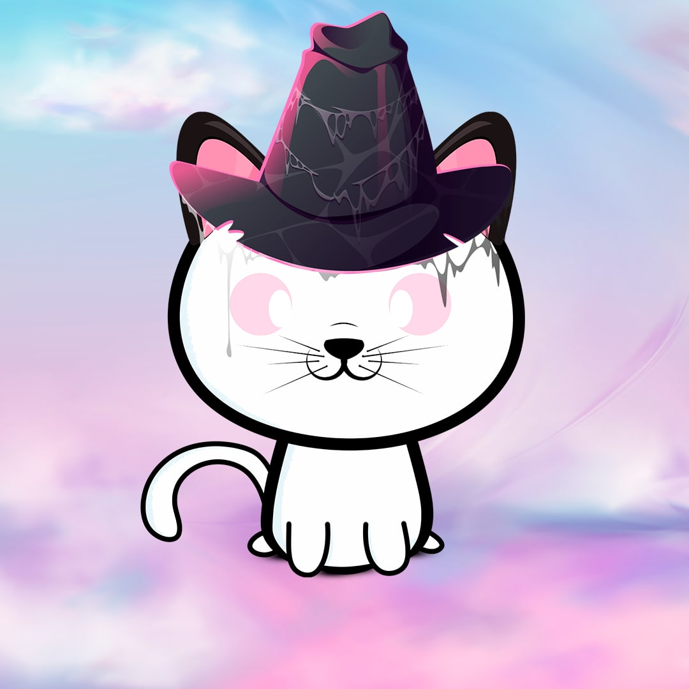<figcaption></figcaption></figure>

 

<figure>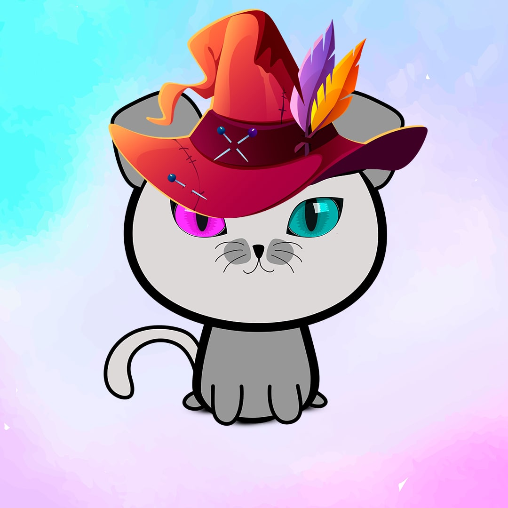<figcaption></figcaption></figure>

 

<figure>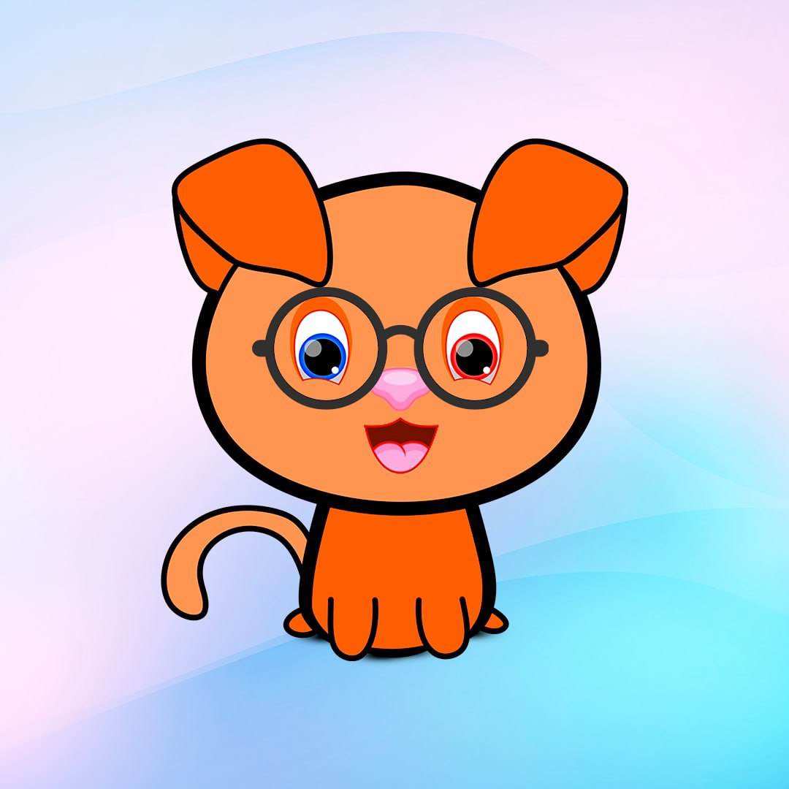<figcaption></figcaption></figure>

 

<figure>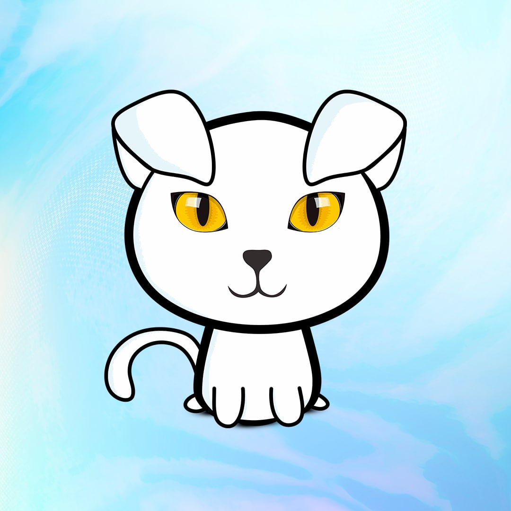<figcaption></figcaption></figure>

 

<figure>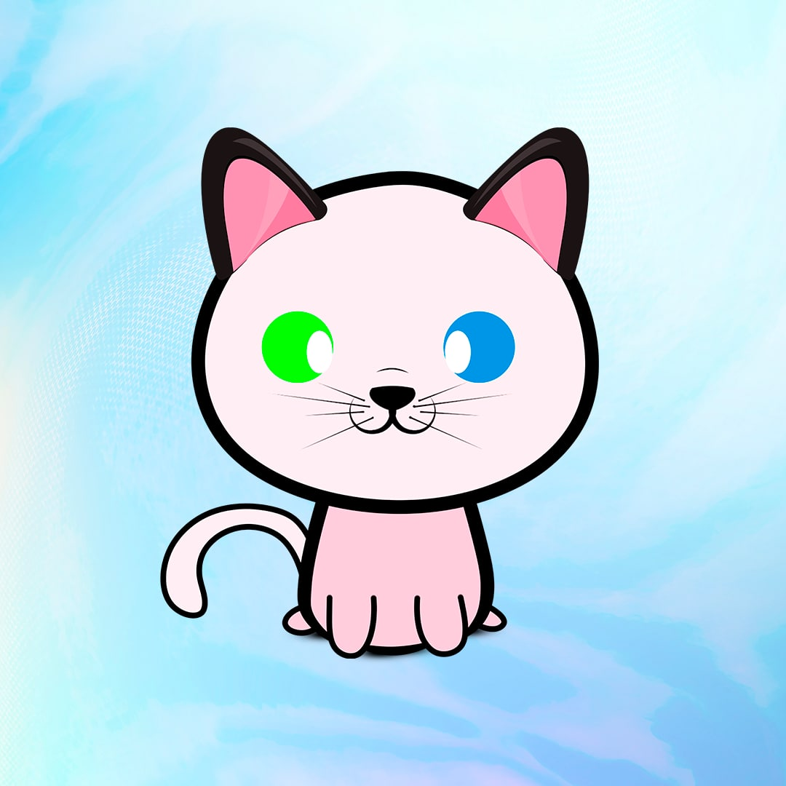<figcaption></figcaption></figure>

 

<figure><figcaption></figcaption></figure>

 

<figure>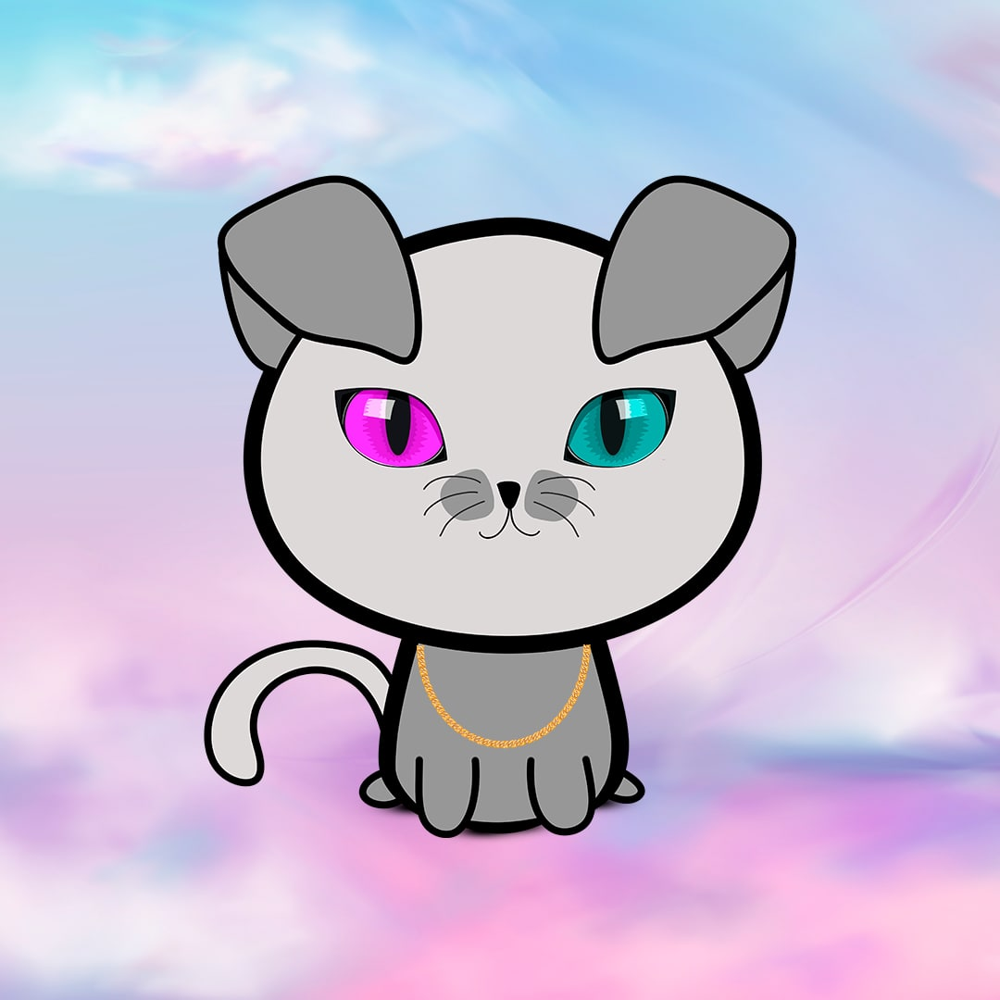<figcaption></figcaption></figure>

 

<figure>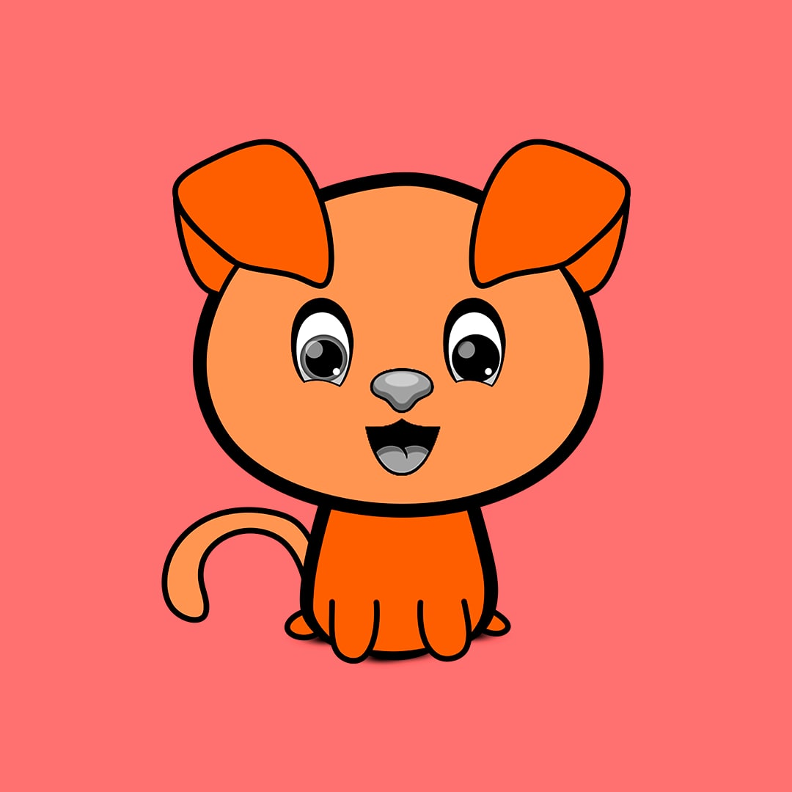<figcaption></figcaption></figure>

 

<figure>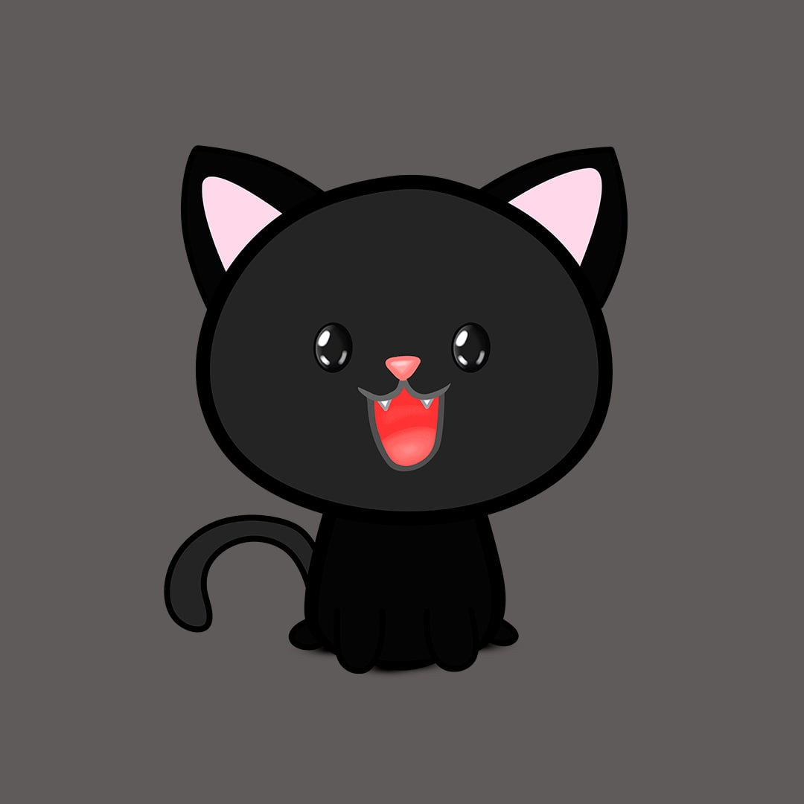<figcaption></figcaption></figure>

 

<figure>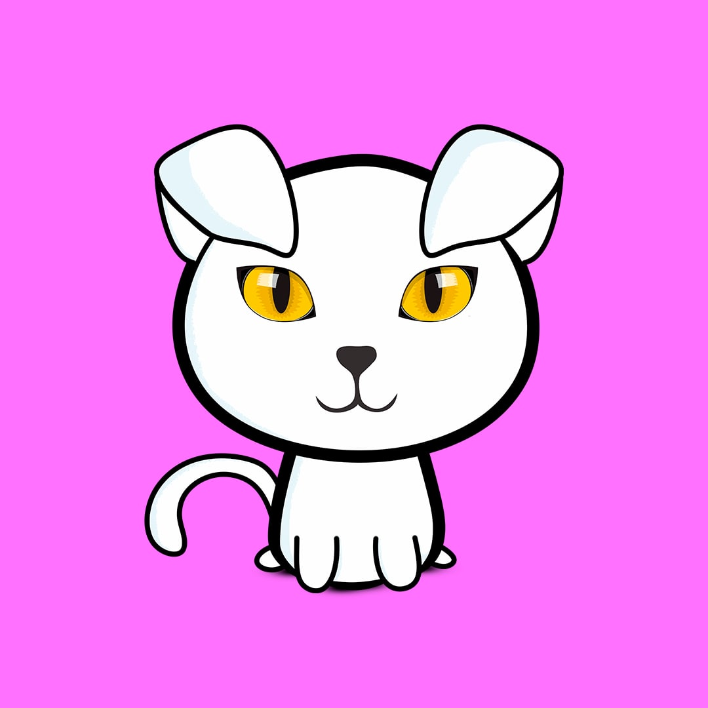<figcaption></figcaption></figure>

 

<figure>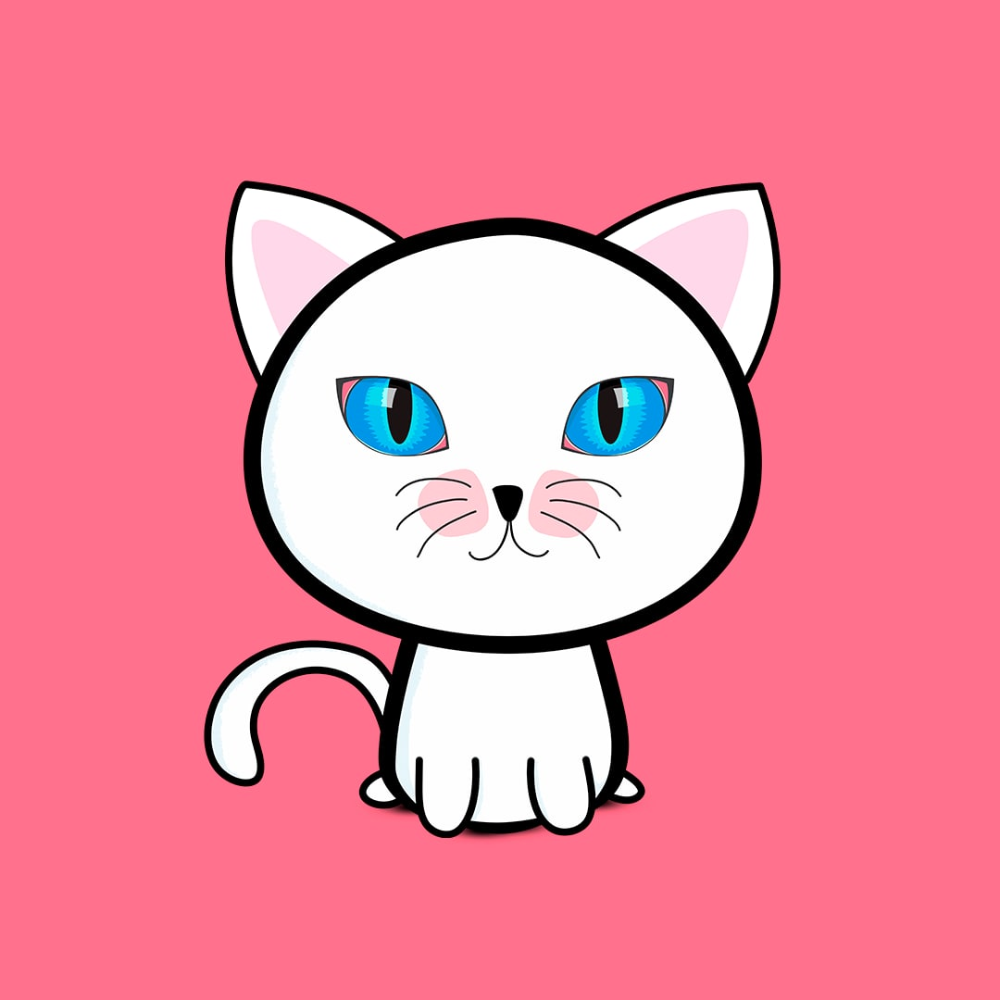<figcaption></figcaption></figure>

