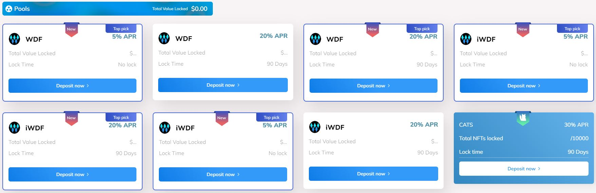

# 🪙 Stake

### `Stake Introduction`

All blockchains have one thing in common: transactions need to get validated. Bitcoin for example does this in a process called mining which is known to use a lot of electricity (Proof-of-Work). There are, though, other consensus mechanisms that are used for validation. Proof-of-Stake (PoS) is one such consensus mechanism that has several variations of its own, as well as some hybrid models. To keep things simple, we will refer to all of these as staking. Coin staking gives currency holders some decision power on the network. By staking coins, you gain the ability to vote and generate an income. It is quite similar to how someone would receive interest for holding money in a bank account or giving it to the bank to invest.

### `What are some of the benefits?`

* One of the major benefits for staking coins is that it removes the need for continuously purchasing expensive hardware and consuming energy.
* The system offers guaranteed returns and a predictable source of income unlike the proof-of-work system where coins are rewarded through a mathmatetical process with a low probability of paying out. Another benefit is that the value of your staked coins doesn't depreciate unlike with ASICs and other mining hardware. Staked coins are only affected by market price fluctuations.

### `How does it work?`

The standard methods for staking are usually holding coins in your wallet or locking them in a smart contract (masternodes). Some coins added randomness to the process of staking and voting so that bad players have a hard time manipulating outcomes. The process can be similar to a lottery in which the number of crypto coins you hold is equivalent to holding a given number of lottery tickets. Staking systems can also allow delegation in which each individual delegates their voting rights and earned income to a trusted party. Those delegates then earn all the rewards for block validation and pay their loyal supporters some form of dividends in return for their vote.

### `Stake Wallet DeFi`

Crypto staking is a new way to earn passive income in the crypto world. It lets users to lock their assets on our platform to receive rewards. All without the need to sell their tokens. This allows them to earn a passive income while still maintaining ownership of their tokens.&#x20;

By locking up tokens on our platform, you can receive rewards depending on the staking duration, and the number of token stakes. To participate in Wallet DeFi staking, you first need to stake the $WDF tokens on our linked crypto wallet. Then, you would have to send the tokens to a staking contract and lock them for a certain period. Once the staking platform locks the $WDF tokens, you start earning rewards.&#x20;

As more people, especially institutional investors, recognize the crypto market's profitability and efficiency, staking is gradually becoming a method of obtaining passive income by simply stake coins in a wallet. Stake Wallet DeFi and earn $WDF tokens in rewards. Since staking cryptocurrencies necessitate certain technological crypto know-how and compliance criteria, including those lacking technical knowledge of Wallet DeFi, staking and receiving rewards. In response to the tremendous increase in crypto staking, If you are interested in earning a passive income by staking, this is the place to be.

|  No lock |    30D    |    90D    |    180D   |
| :------: | :-------: | :-------: | :-------: |
| **`5%`** | **`15%`** | **`20%`** | **`35%`** |

<figure><figcaption></figcaption></figure>
