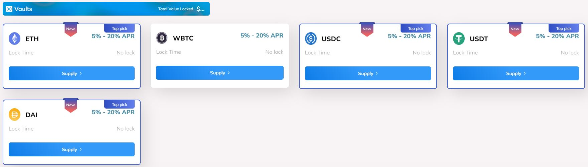

# 🔐 Vault

The WDF Vault is an automated smart contract with Compound Protocol integration and support for ETH, WBTC, USDC, USDT, and DAI markets. The rewards from Compound Protocol are entirely distributed to the users; from the other strategies, a substantial proportion of the rewards (75%) is converted to ETH and distributed to the users, whereas the remainder (25%) is used to buy back our protocol token and burn it.

<figure><figcaption></figcaption></figure>

|   No lock   |
| :---------: |
| **`5-20%`** |
