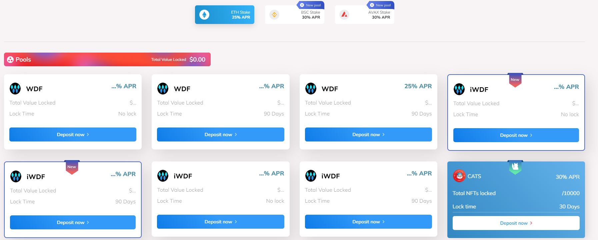

# ⛰ Farming

Crypto staking is a new way to earn passive income in the crypto world. It lets users to lock their assets on our platform to receive rewards. All without the need to sell their tokens. This allows them to earn a passive income while still maintaining ownership of their tokens.&#x20;

By locking up tokens on our platform, you can receive rewards depending on the staking duration, and the number of token stakes. To participate in Wallet DeFi staking, you first need to stake the $WDF tokens on our linked crypto wallet. Then, you would have to send the tokens to a staking contract and lock them for a certain period. Once the staking platform locks the $WDF tokens, you start earning rewards.&#x20;

As more people, especially institutional investors, recognize the crypto market's profitability and efficiency, staking is gradually becoming a method of obtaining passive income by simply stake coins in a wallet. Stake Wallet DeFi and earn $WDF tokens in rewards. Since staking cryptocurrencies necessitate certain technological crypto know-how and compliance criteria, including those lacking technical knowledge of Wallet DeFi, staking and receiving rewards. In response to the tremendous increase in crypto staking, If you are interested in earning a passive income by staking, this is the place to be.

<figure><figcaption></figcaption></figure>
